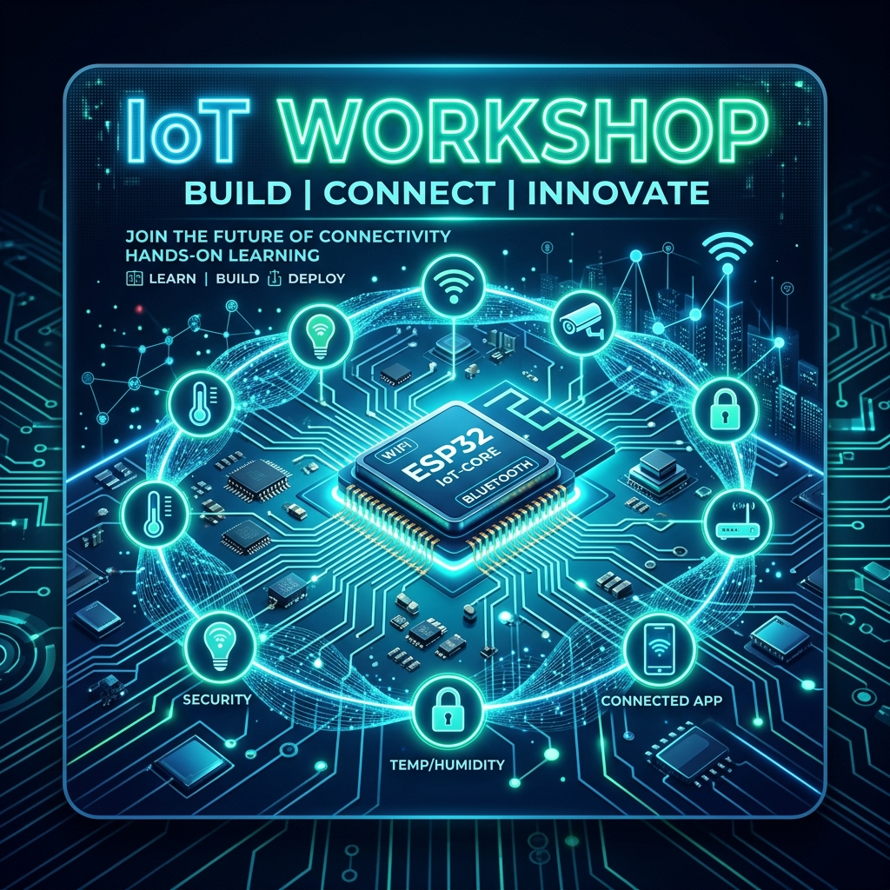

# IoT Workshop: Building the Connected World

Welcome to the **1-Day Hands-on IoT Workshop**. This repository contains all the resources, code samples, and presentations required for the workshop.

## 📋 Table of Contents
1. [Syllabus](./syllabus.md)
2. [Session 1: The IoT Ecosystem](./sessions/session1_introduction/)
3. [Session 2: Interfacing and Logic](./sessions/session2_sensors_actuators/)
4. [Session 3: Cloud Integration with Blynk](./sessions/session3_connectivity/)
5. [Session 4: Advanced Cloud Features & Alerts](./sessions/session4_cloud_dashboard/)
6. [Hardware References](./hardware/)
7. [Installation Guide](./installation.md)

## 🛠️ Hardware Requirements
- NodeMCU (ESP8266 or ESP32 version)
- Breadboard & Jumper Wires
- Sensors: LDR (Light), DHT11 (Temp/Humidity), Buttons
- Actuators: LEDs, Buzzers
- USB Cable (Micro-USB)

## 💻 Software Requirements
- Arduino IDE / VS Code with PlatformIO
- ESP32 Board Manager
- Required Libraries (listed in each session)

---
Developed with ❤️ for the IoT Community.
